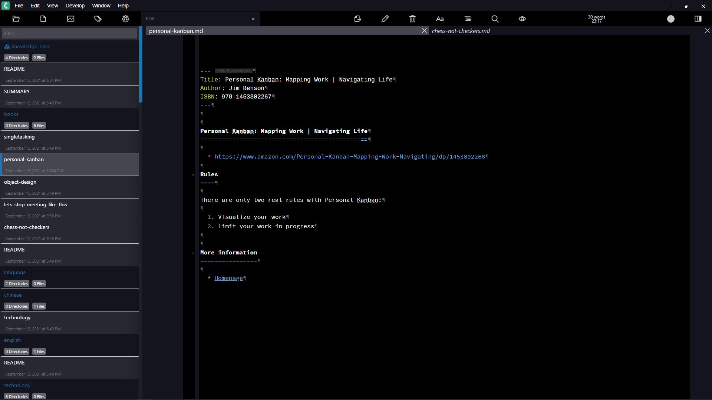

Zettlr - Tomorrow Night Bright
==============================

Custom CSS for [Zettlr](https://www.zettlr.com/) ([GitHub](https://github.com/Zettlr/zettlr))
  * uses Frankfurt as base
  * inspired by [Tomorrow Night Bright](https://github.com/chriskempson/tomorrow-theme)
  * uses [Adobe Source Code Pro](https://github.com/adobe-fonts/source-code-pro)

Note: You have to create a `custom.css` file in the application data folder.

  * Windows:  
    `C:\Users\[username]\AppData\Roaming\Zettlr`
  * Linux:  
    `~/.config/Zettlr/`
